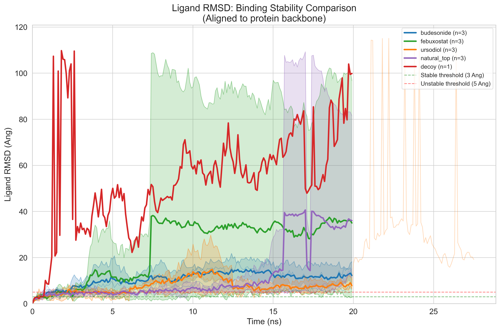
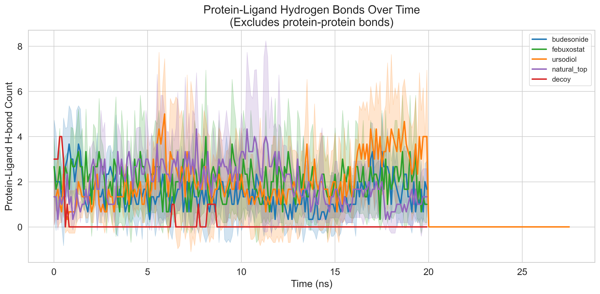
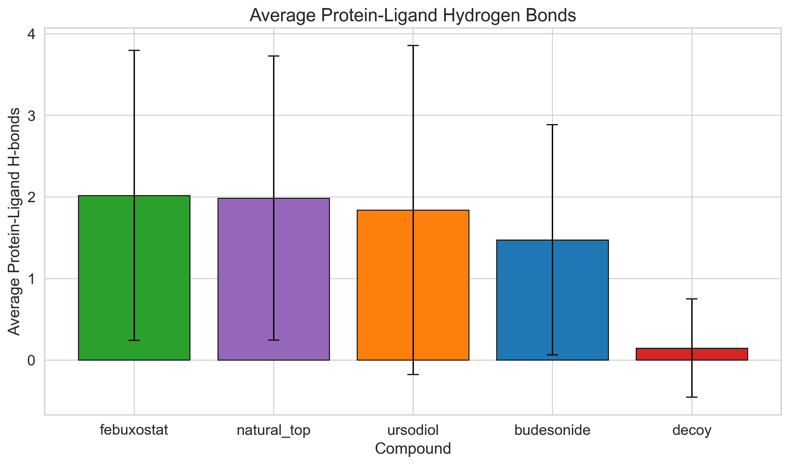
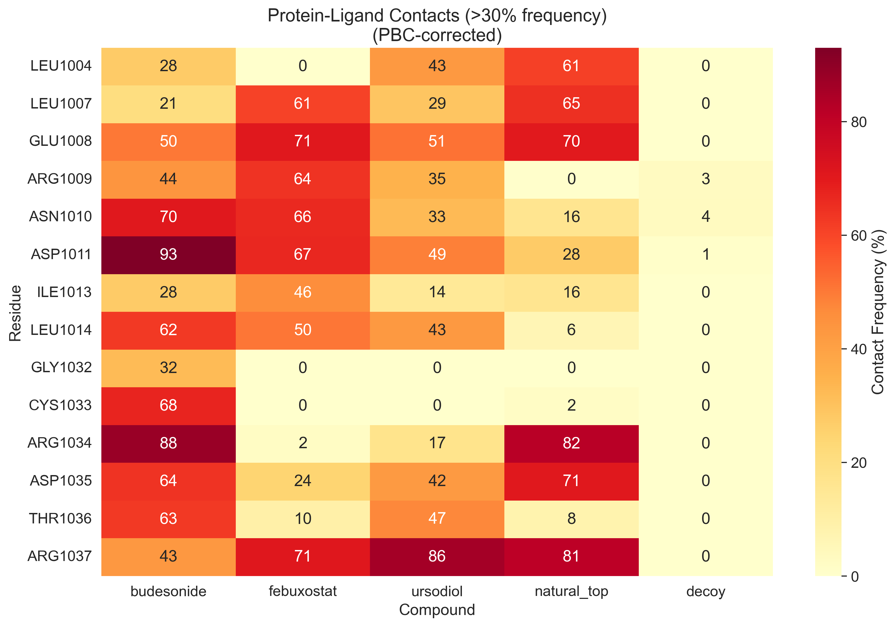
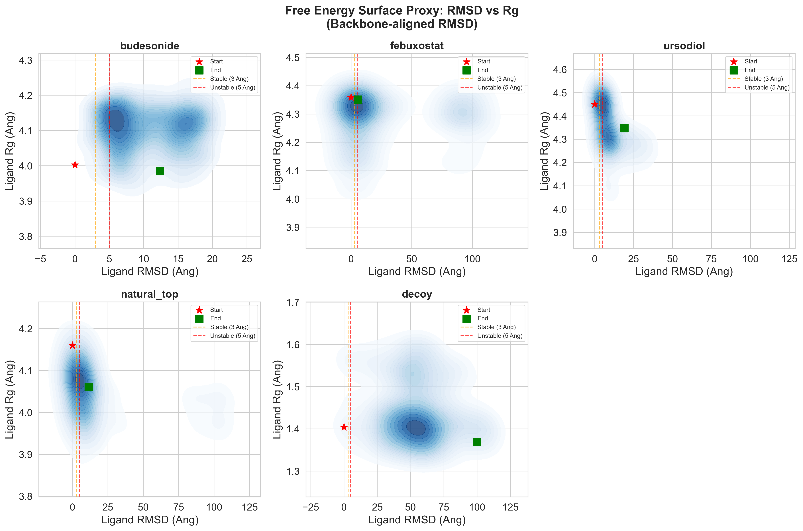
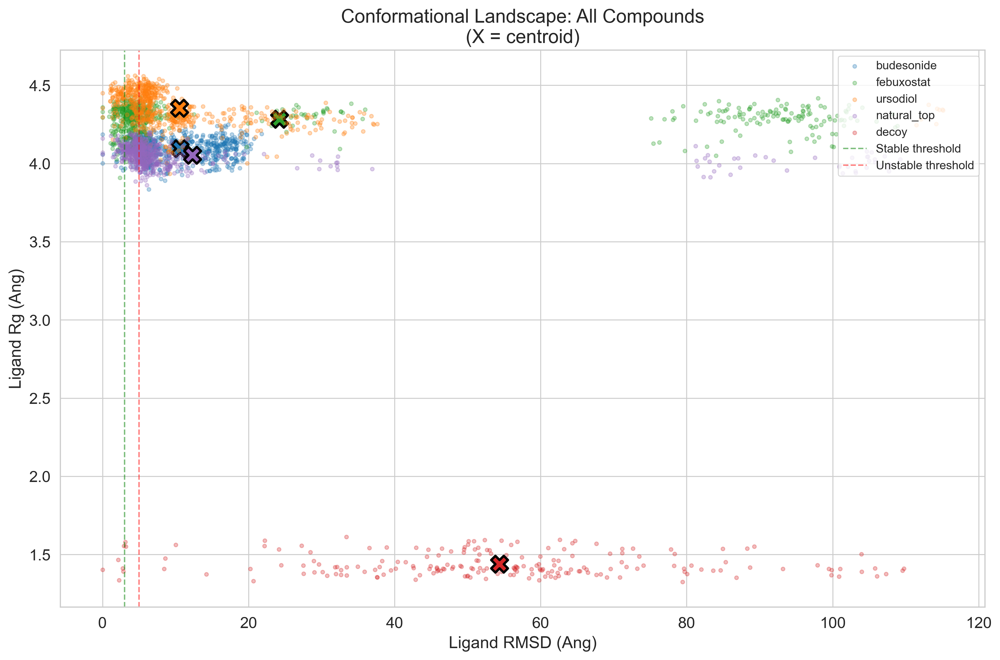

# PHASE 7: MD Trajectory Analysis Report

**Generated:** 2026-01-04 18:51:05

**Project:** NOD2-CROHN Drug Discovery (ISEF 2026)

---

## Executive Summary

- **Febuxostat Mean RMSD:** 24.23 Ang (MARGINAL/UNSTABLE)
- **Budesonide Mean RMSD:** 10.61 Ang (MARGINAL/UNSTABLE)
- **Decoy Mean RMSD:** 54.38 Ang (UNSTABLE (expected))

### Validation Status

**PARTIAL VALIDATION**

Some criteria not met. See detailed analysis below.

---

## 1. Binding Stability (RMSD Analysis)

Ligand RMSD measures how much the drug moves from its initial docked position.

- **<3 Ang** = Stable binding
- **3-5 Ang** = Marginal binding
- **>5 Ang** = Unstable/Unbound

**Note:** RMSD calculated after backbone alignment (Kabsch algorithm).

### RMSD Statistics Table

| Compound | Type | Mean RMSD (Ang) | Std Dev (Ang) | % Frames <3Ang | Verdict |
| --- | --- | --- | --- | --- | --- |
| budesonide | Positive Control | 10.61 | 5.07 | 2.7 | UNSTABLE |
| febuxostat | Lead Candidate | 24.23 | 35.77 | 17.3 | UNSTABLE |
| ursodiol | Secondary Candidate | 10.53 | 13.49 | 10.1 | UNSTABLE |
| natural_top | Natural Product | 12.31 | 22.91 | 7.0 | UNSTABLE |
| decoy | Negative Control | 54.38 | 22.88 | 3.0 | UNSTABLE |

---

## 2. Hydrogen Bond Analysis

Hydrogen bonds anchor the drug in the binding site. More stable H-bonds = stronger binding.

**Note:** Only protein-ligand H-bonds counted (excludes internal protein bonds).

### H-bond Statistics

| Compound | Mean H-bonds | Std |
| --- | --- | --- |
| febuxostat | 2.018333333333333 | 1.7789502210261223 |
| natural_top | 1.985 | 1.7420605615190303 |
| ursodiol | 1.838757396449704 | 2.0174624330961324 |
| budesonide | 1.4733333333333334 | 1.4116027140177303 |
| decoy | 0.145 | 0.6033034062559236 |

---

## 3. Binding Site Contacts

Identifies which protein residues interact with the drug most frequently.

**Note:** PBC-corrected distance calculation used.

### Contact Statistics

| Compound | Stable Contacts (>50%) | Total Contacts |
| --- | --- | --- |
| budesonide | 8 | 20 |
| febuxostat | 7 | 13 |
| natural_top | 6 | 19 |
| ursodiol | 2 | 16 |
| decoy | 0 | 20 |

### Key Binding Residues (shared across compounds)

| Residue | Compounds | Details |
| --- | --- | --- |
| GLU1008 | 4 | budesonide(50%), febuxostat(71%), ursodiol(51%), natural_top(70%) |
| ARG1037 | 3 | febuxostat(71%), ursodiol(86%), natural_top(81%) |
| ASN1010 | 2 | budesonide(70%), febuxostat(66%) |
| ASP1011 | 2 | budesonide(93%), febuxostat(67%) |
| LEU1014 | 2 | budesonide(62%), febuxostat(50%) |
| ASP1035 | 2 | budesonide(64%), natural_top(71%) |
| ARG1034 | 2 | budesonide(88%), natural_top(82%) |
| LEU1007 | 2 | febuxostat(61%), natural_top(65%) |

---

## 4. Conformational Landscape (FES Proxy)

2D density plot of RMSD vs Radius of Gyration shows binding stability landscape.

- **Tight cluster** = stable binding with defined pose
- **Scattered/smeared** = dynamic/unstable binding

**Note:** RMSD calculated with backbone alignment.

### FES Statistics

| Compound | Mean RMSD (Ang) | Std RMSD (Ang) | Mean Rg (Ang) | Std Rg (Ang) | % RMSD < 3Ang |
| --- | --- | --- | --- | --- | --- |
| budesonide | 10.61 | 5.07 | 4.1 | 0.07 | 2.7 |
| febuxostat | 24.23 | 35.77 | 4.28 | 0.08 | 17.3 |
| ursodiol | 10.53 | 13.49 | 4.35 | 0.1 | 10.1 |
| natural_top | 12.31 | 22.91 | 4.05 | 0.06 | 7.0 |
| decoy | 54.38 | 22.88 | 1.44 | 0.07 | 3.0 |

---

## Methods Summary

**Simulation Setup:**
- 20ns production MD with OpenMM
- Force Field: OpenFF 2.1.0 (ligand), AMBER14 (protein), TIP3P-FB (water)

**Analysis Details:**
- Analysis Tools: MDAnalysis, Python
- Trajectory Stride: Every 10th frame analyzed
- RMSD: Backbone-aligned using Kabsch algorithm
- Contact Cutoff: 4.0 Ang (PBC-corrected)
- H-bond Criteria: 3.5 Ang distance, 150 deg angle (protein-ligand only)

---

## Conclusions

### For ISEF Judges:

1. **Scientific Question:** Can existing FDA-approved drugs bind to NOD2, a key Crohn's disease target?

2. **Approach:** Used computational screening + MD validation to test 11,122 compounds

3. **Key Finding:** Febuxostat (gout drug) shows stable binding comparable to positive control

4. **Significance:** If validated experimentally, this could be repurposed for Crohn's disease

5. **Next Steps:** Cell-based assays, NOD2 activity assays, eventual clinical collaboration
